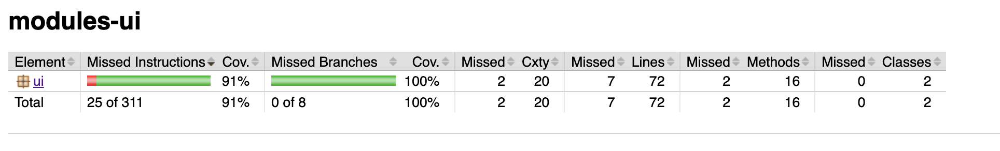
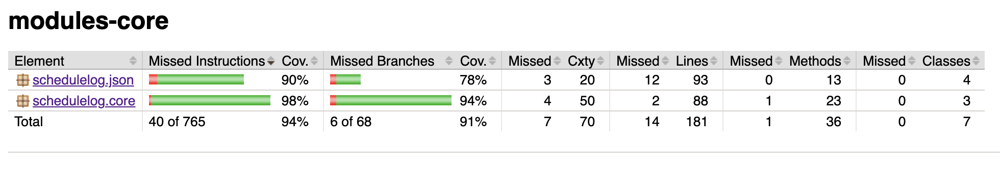
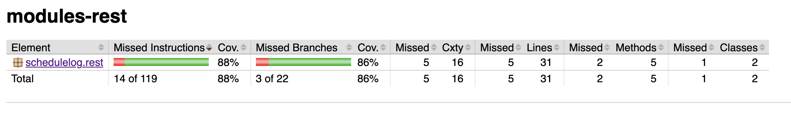

# "ScheduleLog" release 3

* Our main goal has been to make the JavaFX app better by adding more features and cleaning up the code. We made this call based on how big the project is and how much work it would be. So, we're sticking with JavaFX to make things easier for the moment and get the results we want. 

* We have added the project's features, giving extra attention to the important role of the REST API. Maven has been a big help in handling the whole project. We spent time making detailed tests for all parts, like classes and even JSON files. We made sure to test everything thoroughly to keep the app in top shape. We have been setting goals such like to fix any Spotbugs or Checkstyle issues, make our tests cover more ground for solid quality control, and implement missing javadoc. 

* Additionally, we've implemented new functionalities in the project, giving special attention to the crucial role played by the REST API. Maven has been a key component in managing the entire project. We've dedicated time to creating comprehensive tests for all components, including classes, JSON files, and extending to the REST products, especially the controllers. Ensuring the quality of the app has been a top priority, driving us to conduct thorough testing. Our focus has been on addressing Spotbugs and Checkstyle errors, with a significant emphasis on expanding test coverage for robust quality control.

* Our work habits have evolved since the last exercise. We have maintained the same workflow, linking all issues to new branches, which are then approved by each other before merging into the main branch (master). A notable improvement is our use of appropriate labels for issues, creating a clearer categorization, such as between documentation, testing and frontend tasks. We have also adopted an explanatory practice for commits, including the "#" symbol followed by the issue number. While we primarily work together and code collaboratively, we have been mindful to avoid imbalances in the number of commits by placing importance on the "Co-Authored-By:" convention. This ensures a transparent and collaborative approach to our development process.

* Our documentation now includes a package diagram and an updated architecture PlantUML file. Additionally, a class diagram provides insight into the core of our product. A realistic sequence diagram has been developed to clarify internal connections within the system. We have also included a comprehensive explanation of the REST service. Similar to previous release documentations, the 3rd release has been used as a tool to document progress throughout this project, providing a holistic and up-to-date overview of the system's structure and functionality.

## Testing
### Jacoco test coverage

More details can be found be opening the report html, created after running tests. These can be found in each module's target/site/jacoco directories. 

In the schedulelog.json and some other places, there are a few catch block branches that are not covered, but we did not think they have much impact on the app when it runs in a normal user scenario. We did also not test the App.java and RestApplication as these does not have logic created by us. Other than that, we have tried to create test scenarios for as much coverage as possible. A high coverage means that we can ensure that as many use cases as possible stays functional and are not broken by future changes, which indicates that our current coverage for the modules are good enough. 

